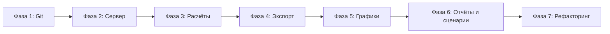

# План доработки финансовой модели до максимальной функциональности

## Текущее состояние

- Один HTML-файл с инлайн-стилями, два скрипта ([calc.js](c:\Users\Inga\Desktop\finmodel-2026\calc.js), [render.js](c:\Users\Inga\Desktop\finmodel-2026\render.js)) без модулей.
- [layout.js](c:\Users\Inga\Desktop\finmodel-2026\layout.js) и [layout_owner.js](c:\Users\Inga\Desktop\finmodel-2026\layout_owner.js) не подключены.
- В [calc.js](c:\Users\Inga\Desktop\finmodel-2026\calc.js) комиссия считается как `wbRevenue * wbFee` (стр. 47) — при `wbFee = 31` это 3100% от выручки; корректно: `* (wbFee/100)`.

---

## Фаза 1: История кода и возможность отката

**Цель:** видимая история изменений и возврат к любой старой версии.

- **Инициализировать Git** в корне проекта: `git init`, добавить `.gitignore` (node_modules, .env, логи).
- **Делать коммиты** после каждой логической доработки (например: «добавлен экспорт в CSV», «исправлена формула комиссии»). Так история изменений будет в истории репозитория, а откат — через `git checkout <commit>` или через ветки.
- Опционально: настроить удалённый репозиторий (GitHub/GitLab) для бэкапа и просмотра истории в веб-интерфейсе.

**Результат:** любая версия кода доступна через Git; откат — выбор нужного коммита или ветки.

---

## Фаза 2: Сервер и структура проекта

**Цель:** единая точка входа, API для сохранения сценариев и истории, удобная доработка кода.

- **Выбор стека:** лёгкий backend на Node.js (Express) или Python (Flask/FastAPI). Рекомендация: Node + Express, если фронт остаётся на JS; один язык и проще общая сборка.
- **Структура папок (пример):**
  - `server/` — код сервера (запуск, маршруты API).
  - `public/` или `frontend/` — статика: `index.html`, `styles.css`, скрипты (или собранный фронт).
  - `data/` или БД (SQLite/JSON-файлы) — сохранённые сценарии и снапшоты расчётов (по желанию).
- **Сервер:**
  - Раздаёт статику из `public/`.
  - API (пример): `GET/POST /api/scenarios` — список сохранённых сценариев; `POST /api/scenarios` — сохранить текущие параметры и (опционально) результат расчёта; `GET /api/scenarios/:id` — загрузить сценарий по id. Так появится «история сценариев», а не только история кода.
- **Запуск:** `node server/index.js` или `npm run start`; в браузере — `http://localhost:3000`.

**Результат:** приложение открывается через сервер; есть API для сохранения/загрузки сценариев и просмотра их истории.

---

## Фаза 3: Исправления и расширение расчётов

**Цель:** корректные формулы и больше статей для «максимальной» функциональности модели.

- **Исправить баги в [calc.js](c:\Users\Inga\Desktop\finmodel-2026\calc.js):**
  - Комиссия WB: `wbRevenue * (wbFee / 100)` (и аналогично Ozon).
- **Добавить в модель (по желанию, шаг за шагом):**
  - Прочие постоянные расходы (аренда, софт, прочее) — одна сумма в месяц или по статьям.
  - Уточнение налога: выбор УСН 6% или 15% (с учётом ограничений), либо оставить 2% как упрощение.
  - Простой денежный поток: выручка по факту оплаты (лаг 1–2 месяца для маркетплейсов), выплаты себестоимости/логистики с лагом; итог — помесячный кэш и накопительный остаток (без сложной бухгалтерии).
- **Параметры в панели:** слайдеры/поля для новых статей (прочие расходы, тип УСН, лаги), без перегрузки интерфейса — сгруппировать в «Расширенные» или вкладки.

**Результат:** формулы без ошибок; при необходимости — больше статей расходов и простой кэш-флоу.

---

## Фаза 4: Экспорт и печать

**Цель:** выгрузка данных и удобная печать.

- **Экспорт в CSV:** по кнопке «Скачать CSV» формировать таблицу из текущей отображаемой таблицы (те же строки/столбцы), скачивание через `Blob` + ссылка с `download`.
- **Экспорт в Excel (XLSX):** подключить легковесную библиотеку (например, SheetJS / xlsx) только для страницы экспорта; кнопка «Скачать Excel» — те же данные, лист «План 2026».
- **Печать:** отдельная страница или режим «Только таблица» (скрыть панель слайдеров, увеличить шрифт таблицы), стили `@media print` в [styles.css](c:\Users\Inga\Desktop\finmodel-2026\styles.css) или в отдельном файле; кнопка «Печать».

**Результат:** пользователь может скачать модель в CSV/Excel и распечатать отчёт.

---

## Фаза 5: Графики и визуализация

**Цель:** наглядное отображение динамики.

- **Библиотека:** Chart.js или аналогичная (легко подключить без сборки).
- **Графики (один общий блок под или над таблицей):**
  - Выручка по месяцам: два ряда — WB и Ozon (столбцы или линии).
  - Чистая прибыль и накопленный итог по месяцам (линии).
  - Доля маржи/расходов за год (круговая или столбчатая диаграмма по итоговым суммам).
- Данные брать из уже рассчитанного `modelData` в [render.js](c:\Users\Inga\Desktop\finmodel-2026\render.js), не дублировать расчёты.

**Результат:** 2–3 графика обновляются при изменении параметров и повышают наглядность.

---

## Фаза 6: Несколько видов отчёта и сравнение сценариев

**Цель:** полный отчёт, краткий для собственника, сравнение «База / Оптимистичный / Стресс».

- **Подключить [layout.js](c:\Users\Inga\Desktop\finmodel-2026\layout.js) и [layout_owner.js](c:\Users\Inga\Desktop\finmodel-2026\layout_owner.js):** перевести фронт на модули (ES modules) или собрать один бандл; рендер таблицы делать по выбранному layout: «Полный» (текущий полный набор строк) и «Для собственника» (краткий набор из `layout_owner.js`). Переключатель в UI: «Полный отчёт | Краткий отчёт».
- **Сравнение сценариев:** один расчёт на сценарий (base, opt, stress) с текущими слайдерами; вывести три колонки «Итог за год» (выручка, маржа, чистая прибыль) в виде компактной таблицы или блока «База / Опт / Стресс» под основную таблицу. Либо вкладка «Сравнение сценариев» с такой таблицей и, при желании, простым графиком по трём точкам.

**Результат:** два формата отчёта (полный и краткий) и наглядное сравнение трёх сценариев.

---

## Фаза 7: Удобство разработки и стабильность

**Цель:** проще дописывать и улучшать код, меньше поломок.

- **Вынести стили** из [index.html](c:\Users\Inga\Desktop\finmodel-2026\index.html) в [styles.css](c:\Users\Inga\Desktop\finmodel-2026\styles.css) и подключать одним тегом `<link>`.
- **Разбить скрипты по ролям:** расчёты остаются в `calc.js`; рендер таблицы — в `render.js` (или `table.js`); рендер графиков — в `charts.js`; работа с API сценариев — в `api.js` или внутри одного `app.js`. При использовании layout — один модуль `layout.js`, который импортирует конфиги из `layout.js` / `layout_owner.js`.
- **Единая точка входа:** один скрипт (например `app.js`) подключается в `index.html` с `type="module"`; он импортирует calc, render, charts, api и вешает обработчики (слайдеры, кнопки экспорта/печати, выбор отчёта).
- **Проверка формул:** пройти по [calc.js](c:\Users\Inga\Desktop\finmodel-2026\calc.js) и сверить все проценты (комиссия, себестоимость, реклама, УСН) — везде деление на 100 где нужно.
- Опционально: простые тесты (Jest или ручной прогон) на `calculateModel` при фиксированных `params` — ожидаемые суммы по одному месяцу и итогу за год.

**Результат:** понятная структура, один вход, меньше дублирования, проверенные формулы.

---

## Порядок внедрения (рекомендуемый)

1. **Фаза 1** — сразу, без изменения кода модели.  
2. **Фаза 2** — поднять сервер и раздачу статики; при желании — минимальный API сохранения сценариев.  
3. **Фаза 3** — исправление комиссии и, по шагам, новые статьи/налоги/кэш.  
4. **Фаза 4** — кнопки CSV, Excel, печать.  
5. **Фаза 5** — подключить графики.  
6. **Фаза 6** — переключатель полный/краткий отчёт и блок сравнения сценариев.  
7. **Фаза 7** — рефакторинг и тесты по мере необходимости.

---

## Итог

- **История и откат:** Git в проекте + коммиты после доработок; при желании — удалённый репозиторий.  
- **Сервер:** раздача фронта + API сохранения/загрузки сценариев (история сценариев).  
- **Функциональность модели:** исправленные формулы, при необходимости — доп. расходы, налоги, простой кэш-флоу.  
- **Удобство использования:** экспорт CSV/Excel, печать, графики, два вида отчёта, сравнение сценариев.  
- **Удобство доработки:** структура папок, модули, один вход, вынесенные стили, проверка формул.

После утверждения плана можно переходить к реализации по фазам (начиная с Git и сервера).